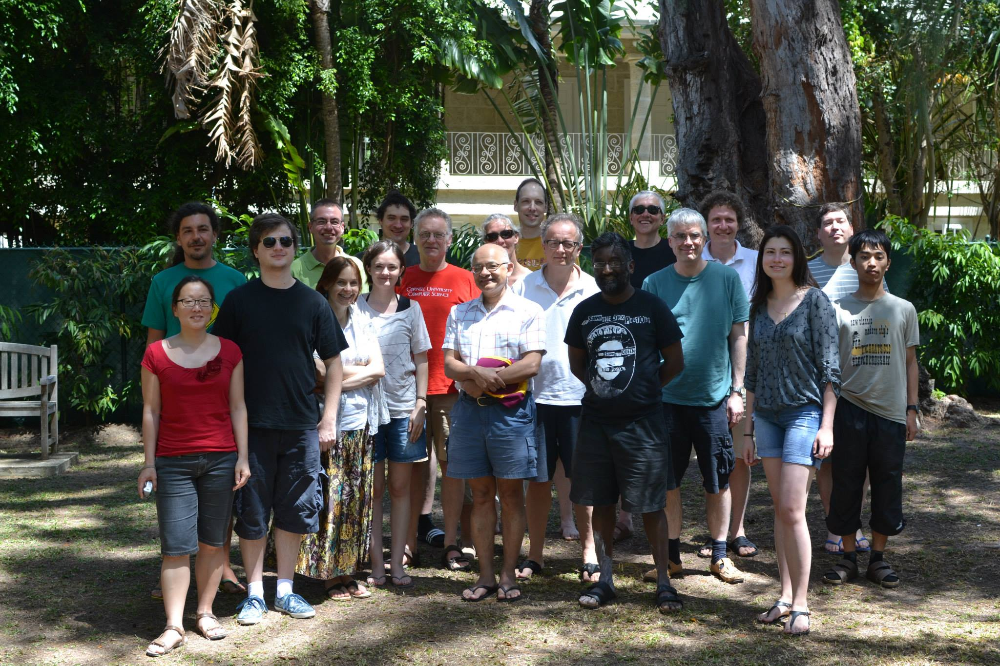
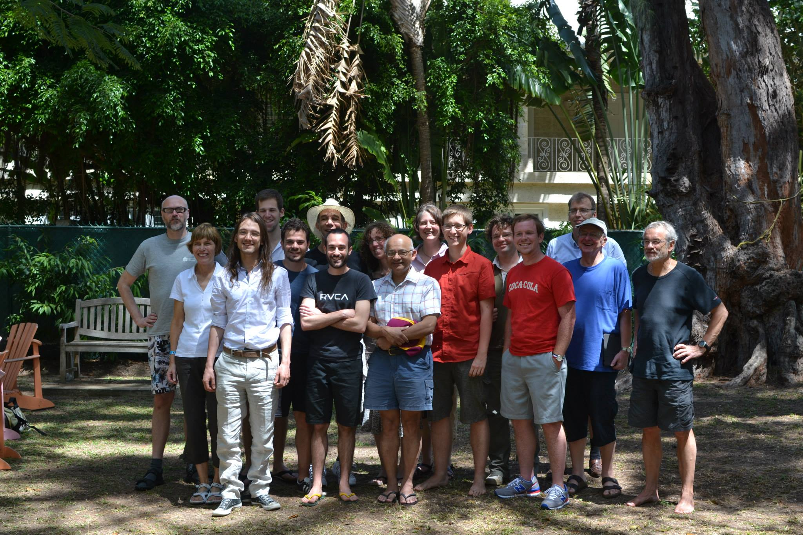

# Bellairs 2014: Workshops on Duality and Probabilistic Systems

There will be two worshops during the week **14th March to 21st March 2014**: one focussed on duality and one focussed on probabilistic systems. We will arrange it so that only half the time will both meetings run simultaneously so that people can maximize attendance at both meetings if they want. We hope that there will be some cross fertilization of ideas across the two meetings. There will also be ample time for discussions and working groups.

The workshop on Duality will be on topics related to duality in its various manifestations. These include Stone-type dualities, Gelfand duality, duality theorems in logic, algebra, formal language theory, denotational semantics, Markov process theory, quantum mechanics and whatever else may appeal to the audience. 

### Participants Duality workshop 

Filippo Bonchi, Corina Cirstea, Martin Escardo, Robert Furber, Mai Gerhke, Neil Ghani, Helle Hansen, Bart Jacobs, Achim Jung, Toshiki Kataoka, Bartek Klin, Dexter Kozen, Clemens Kupke, Alexander Kurz, Radu Mardare, Stefan Milius, Prakash Panangaden, Dirk Pattinson, Daniela Petrisan, Alexandra Silva, Alex Simpson and Luca Spada.

The workshop on Probabilistic Systems will be on topics related to probabilistic systems in verification, semantics and logic. This includes topics like probabilistic bisimulation, logics for probabilistic processes, algorithms for model checking, approximation, metrics etc. 

### Participants Probabilistic Systems workshop 
Giorgio Bacci, Christel Baier, Henning Basold, Franck van Breugel, Josee Desharnais, Ernst-Erich Doberkat, Holger Hermanns, Henning Kerstan, Barbara Koenig, Tyler Marker, Matteo Mio, Joel Ouaknine, Prakash Panangaden, Bas Westerbaan and Glynn Winskel.

### Group Pictures

#### Duality Worskshop

#### Probabilistic Systems Worskshop

## Organisational details 

The workshop organizers are Prakash Panangaden and Alexandra Silva. Attendance is by invitation only.

The workshop period runs from 14th March 2014 to 21st March 2014 and will take place at the Bellairs Research Institute in Barbados. The actual meeting dates are from the 16th March (Sunday) to 20th March (Thursday). [Here](schedule14.pdf) is the schedule of talks. We can hold impromptu talks on Thursday.

