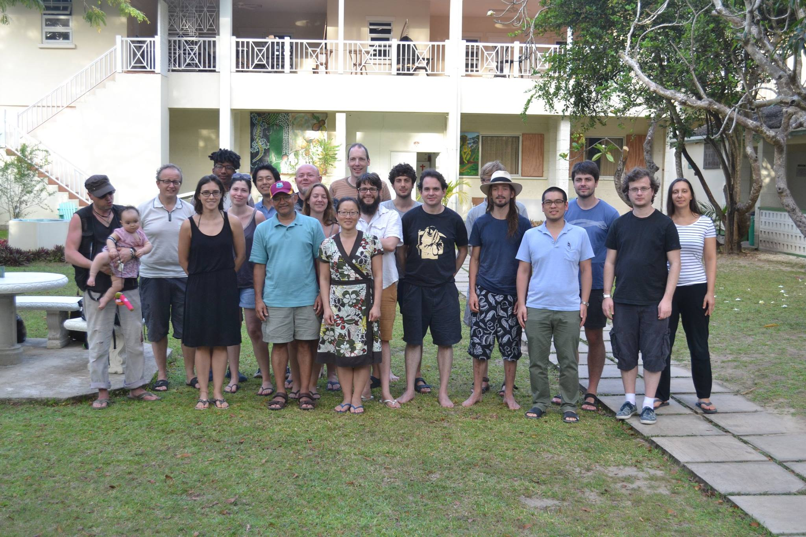

# Bellairs 2015

There will be two workshops during the week **13th March to 20th March 2015**: [one](http://www.cs.ox.ac.uk/conferences/oxford_iss2015/index.html) focused on infinite-state systems, organised by [Joel Ouaknine](http://people.mpi-sws.org/~joel/), and [one](http://homepage.tudelft.nl/c9d1n/bellairs2015/bellairs15.html#) focused on Coalgebras in Quantum Physics, organised by [Helle Hansen](http://homepage.tudelft.nl/c9d1n/) and [Prakash Panangaden](http://www.cs.mcgill.ca/~prakash). 

### Group Picture Coalgebra group

