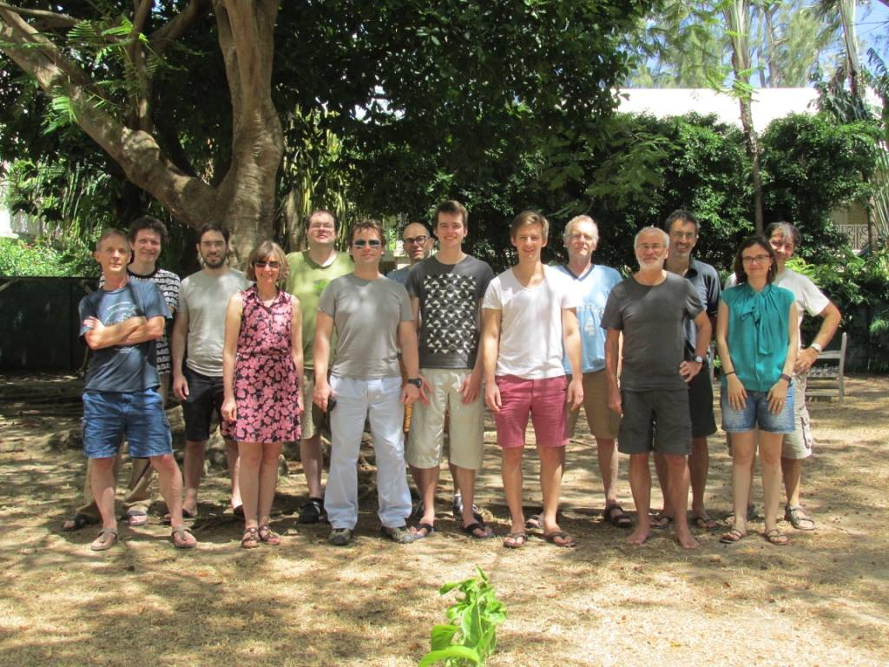

# Bellairs 2016: Workshops on Formal Methods for Software-Defined Networks and Causality in Quantum Foundations

There will be two workshops during the week **11th March to 18th March 2016**. One focused on topics related to formal methods for software-defined networks. These include various aspects related to programming language design, verification, security, etc.  The other workshop will be on Causality in Quantum Foundations, organised by Bob Coeke and Prakash Panangaden. 

### Participants 
The participants of the 2016 workshop: Alexandra Silva, Bartek Klin, Carroll Morgan,
Dexter Kozen, Gilles Barthe, Glynn Winskel, Joost-Pieter Katoen, Pedro D'Argenio, Radu Mardare,  Tim Nelson, Steffen Smolka, Joshua Moerman, Marta Kwiatkowska, Matteo Sammartino.

### Group Picture

## Organisational details 

The workshop organizer is Alexandra Silva. Attendance is by invitation only.

The workshop period runs from 11th March 2016 to 18th March 2016 and will take place at the Bellairs Research Institute in Barbados. The actual meeting dates are from the 13th March (Sunday) to 17th March (Thursday).

