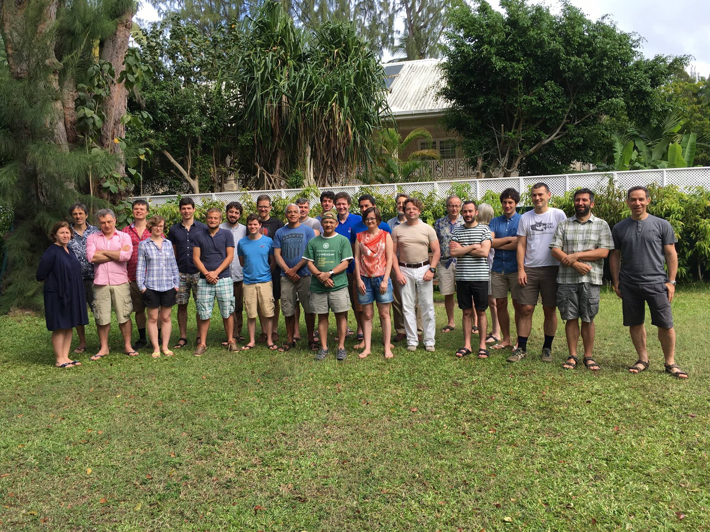

# Bellairs 2017: Workshops on Probabilistic Programming Languages and Dynamical Systems

There will be two workshops during the week **10th March to 17th March 2017**: one focused on Probabilistic Programming Languages, organized by Alexandra Silva and Prkash Panangaden, and another on Dynamical Systems, organised by Joel Ouaknine and Ben Worrell.

### Participants Probabilistic Programming Languages workshop
The participants of the workshop are: Alexandra Silva, Prakash Panangaden, Steffen Smolka, Nate Foster, 
Joost-Pieter Katoen, Annabelle McIver, Gilles Barthes, Marco Gaboardi, Chris Heunen, Bartek Klin, 
Radu Mardare, Florence Clerc, Bart Jacobs, Fabio Zanasi, Vincent Danos, Ugo Dal Lago.

### Group Picture both workshops

## Organisational details 

The workshop organizers are Prakash Panangaden and Alexandra Silva. Attendance is by invitation only.

The workshop period runs from 10th March 2017 to 17th March 2017 and will take place at the Bellairs Research Institute in Barbados. The actual meeting dates are from the 12th March (Sunday) to 16th March (Thursday). 

