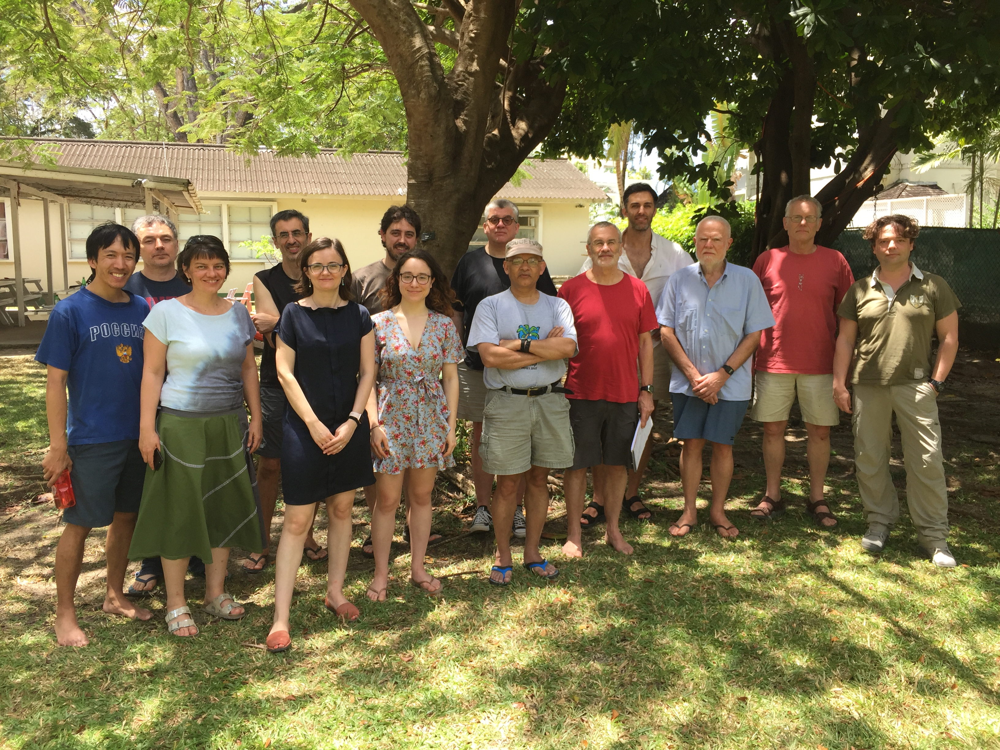

# Bellairs 2018: Workshop Logical Foundations for Data Science

There will be two worshops during the week **16th March to 23rd March 2018**: one focussed on Logical Foundations for Data Science and one focussed on Compositional methods for network diagrams and component-based systems, organised by [Fabio Zanasi](http://www.zanasi.com/fabio). 

### Participants LFDS workshop 

Alexandra Silva,
Ana Sokolova,
Borja Pigem de Balle,
Dan Roy,
David Pym,
Dexter Kozen,
Gilles Barthe,
Glynn Winskel,
Justin Hsu,
Koko Muroya,
Pascale Gourdeau,
Prakash Panangaden,
Radu Mardare,
Vincent Danos.

### Group Picture

## Organisational details 

The workshop organizers are Prakash Panangaden and Alexandra Silva. Attendance is by invitation only.

The workshop period runs from 16th March 2018 to 23rd March 2018 and will take place at the Bellairs Research Institute in Barbados. The actual meeting dates are from the 18th March (Sunday) to 22nd  March (Thursday). 

