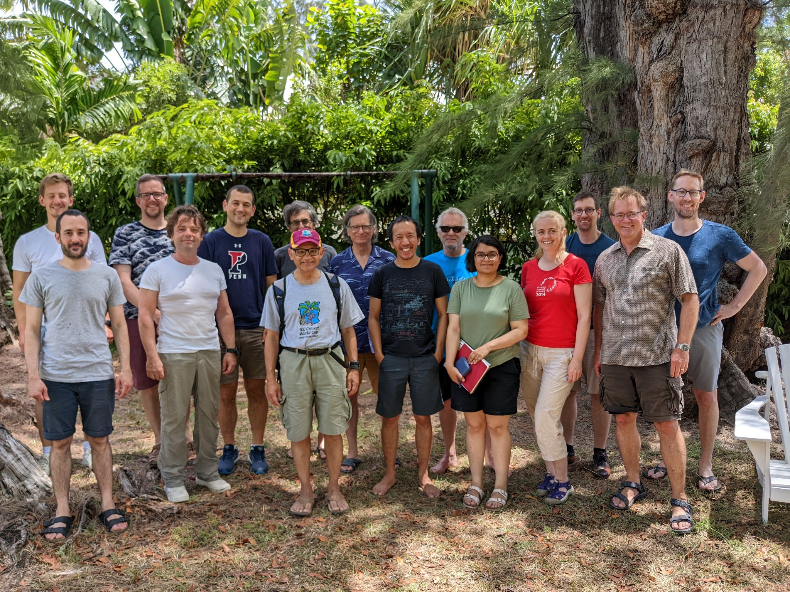

# Bellairs 2022: Workshops on Probabilistic Systems and Reasoning Principles and Network Verification.  

There will be two workshops during the week **20th to 27th May 2022**: one on Probabilistic Systems and Reasoning Principles and one on Network Verification.

### Participants Probabilistic Systems and Reasoning Principles

Giorgio Bacci, 
Gilles Barthe, 
Fredrik Dahlqvist,
Justin Hsu,  
Benjamin Kaminski, 
Bruce Kapron, 
Dexter Kozen, 
Ugo Dal Lago, 
Radu Mardare, 
Prakash Panangaden.

### Participants Network Verification workshop 

Nikolaj Bjorner, 
Nate Foster, 
Brighten Godfrey,  
Karuna Grewal, 
Ruzica Piskac, 
Sundararajan Renganathan, 
Fabian Ruffy, 
Steffen Smolka, 
David Walker, 
Thomas Wies. 

### Group Picture (both workshops)

## Organisational details 

The workshop organizers are Prakash Panangaden and Alexandra Silva (Probabilistic Systems and Reasoning Principles) and Nate Foster (Network Verification). Attendance is by invitation only.

The workshop period runs from 20th to 27th May 2022 and will take place at the Bellairs Research Institute in Barbados. The actual meeting dates are from the 22nd May (Sunday) to 26th May (Thursday). 

