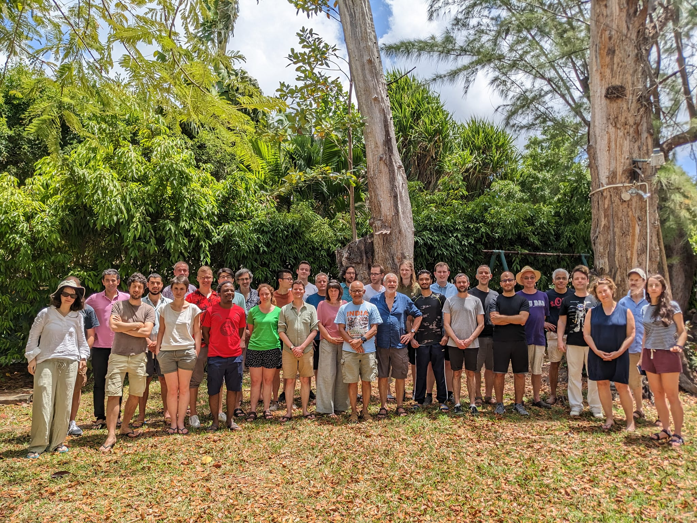

# Bellairs 2023: Workshops on Quantitative Equational Logic and Dynamical Systems.  

There will be two workshops during the week **28th April to 5th May 2023**: one on Quantitative Equational Logic and one on Dynamical Systems.

### Participants Quantitative Equational Logic workshop
Jiri Adamek,
Giorgio Bacci,
Gilles Barthe,
Matteo Capucci,
Rafaëlle Crubille,
Bart Jacobs,
Benjamin Kaminski,
Marie Kerjean,
Radu Mardare,
Stefan Milius,
Matteo Mio,
Prakash Panangaden,
Ralph Sarkis,
Todd Schmid,
Ana Sokolova,
Henning Urbat,
Glynn Winskel,
Fabio Zanasi.

### Participants Dynamical Systems workshop 

Valérie Berthé, 
Ruiwen Dong, 
Toghrul Karimov, 
Lutz Klinkenberg, 
Florian Luca, 
Martina Maggio, 
Rupak Majumdar, 
Marcel Moosbrugger, 
Joris Nieuwveld, 
Armand Noubissie, 
Joël Ouaknine, 
David Purser, 
Bruno Salvy, 
Emre Sertöz, 
Mihir Vahanwala, 
James Worrell, 
Clara Lacroce.

### Group Picture (both workshops)

## Organisational details 

The workshop organizers are Prakash Panangaden and Alexandra Silva (Quantitative Equational Logic) and Joël Ouaknine (Dynamical Systems). Attendance is by invitation only.

The workshop period runs from 28th April 2024 to 5th May 2024 and will take place at the Bellairs Research Institute in Barbados. The actual meeting dates are from the 30th April (Sunday) to 4th May (Thursday). 

